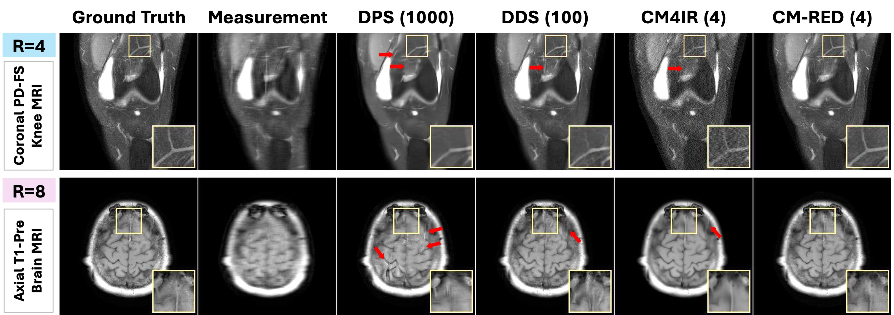

# Consistency Models for Fast MRI Using Regularization by Denoising (ISBI 2026) #

[Merve Gulle](https://scholar.google.com/citations?user=Pmu-yJYAAAAJ&hl=en), [Junno Yun](https://scholar.google.com/citations?user=Ou4ff9kAAAAJ&hl=en&oi=ao), [Yasar Utku Alcalar](https://scholar.google.com/citations?user=9N2YMjEAAAAJ&hl=en&oi=ao), [Mehmet Akcakaya](https://scholar.google.com/citations?user=x-q3XC4AAAAJ&hl=en&oi=ao), University of Minnesota

<!--  -->
<p align="center">
  
</p>


---

# Installation #

### 1. Clone This Repository

```bash
git clone https://github.com/MerveGulle/CM-RED.git
```

### 2. Create Conda Environment and Install Requirements

```bash
conda create -n {env_name} python=3.10
conda activate {env_name}

cd CM-RED
pip install requirements.txt
```

### 3. Pre-trained CM Models

We provide pre-trained CM models for the **fastMRI knee** and **brain** datasets. \
Pre-trained CM models are available at the following here [link](https://www.dropbox.com/scl/fo/l5q06udyq1zbg2rhjbvvm/AFSAMaZbHmJNG1Nd1qyJ-Ko?rlkey=h2np6dpba8tnnv3pc66ew5o7x&dl=0). \
Please download and place the pre-trained models under: ./exp/logs/fast_mri/
```bash
./exp/logs/fast_mri/
├── cm_ckpt (knee)
└── cm_ckpt (brain)
```

### 4. Dataset

Please download the **fastMRI** dataset from [fastMRI](https://fastmri.med.nyu.edu/) after agreeing to the data use agreement.

We use the following validation sets for evaluation:  
- `knee_multicoil_val`  
- `brain_multicoil_val_batch_i`

Coil sensitivity maps are generated using the `sigpy.mri.app.EspiritCalib` function.

The preprocessed dataset should be placed under:

```bash
./exp/datasets/fast_MRI/
├── PD
├── PDFS
├── AXT1PRE
└── ...
```

Make sure the preprocessed files are in **.mat format** and contain the following keys:

```python
# k-space data
kspace  # shape: (C, H, W)

# coil sensitivity maps
coils   # shape: (C, H, W)
```

`./datasets/fast_mri.py` loads the raw k-space data and the corresponding coil sensitivity maps.


### 5. Run MRI Reconstrcution Code
```bash
sh evaluate.sh
```
You can configure the dataset, model, and number of iterations (NFEs) in `configs/fast_mri_320.yml`.
The hyperparameters corresponding to the settings reported in the paper are implemented as defaults in `evaluate.sh`.
For additional customization or hyperparameter tuning, please edit evaluate.sh accordingly.

## Quick Start
Use the following commands to generate CM-RED results:

1. fastMRI coronal PD knee, R=4, gaussian-1D undersampling:
    ```bash
    python main.py -i CM_RED-knee_PD-ACC_4-gaussian1d  --data_type="PD" --acc_rate 4 --pattern="gaussian1d" \
        --iN=50 --gamma=0.1 --deltas="0.4,3.0,3.0,2.5" --kappas="0.5,5.0" --rho=-2.0 --mu=0.9 \
        --model_ckpt "fast_mri/ema_0.9999432189950708_700000_cm_knee.pt" --save_y
    ```

2. fastMRI axial T1-pre brain, R=8, equidistant undersampling:
    ```bash
    python main.py -i CM_RED-brain_T1PRE-ACC_8-equidistant  --data_type="T1PRE" --acc_rate 8 --pattern="equidistant" \
        --iN=50 --gamma=0.1 --deltas="0.5,7.0,6.0,3.5" --kappas="1.0,2.5" --rho=-3.0 --mu=0.9 \
        --model_ckpt "fast_mri/ema_0.9999432189950708_1050000_cm_brain.pt" --save_y
    ```

## Acknowledgements

This codebase is mainly built upon [CM4IR](https://github.com/tirer-lab/CM4IR) repository.

## 📝 Citation
If you find this repository useful in your research, please consider citing our work:
```bibtex

@inproceedings{gulle2026_ISBI,
  title = {{C}onsistency models for fast {MRI} using regularization by denoising},
  author={G{\"u}lle, Merve and Yun, Junno and Al{\c{c}}alar, Ya{\c{s}}ar Utku and Ak{\c{c}}akaya, Mehmet},
  booktitle = ISBI,
  year = 2026,
}

```
